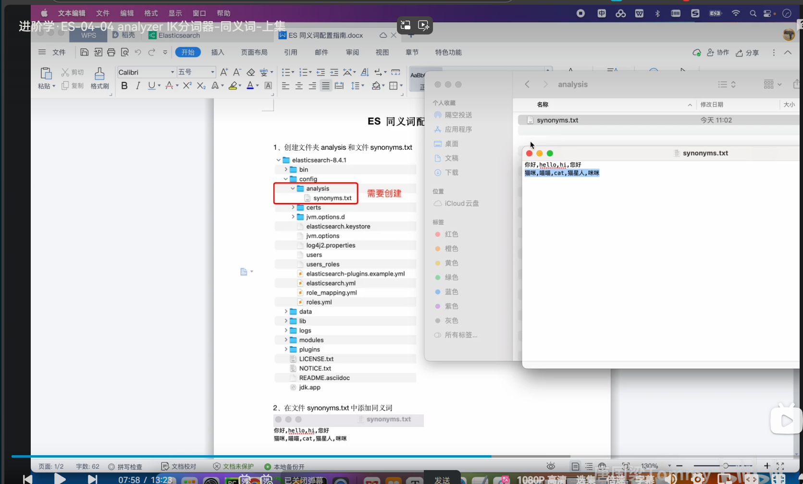
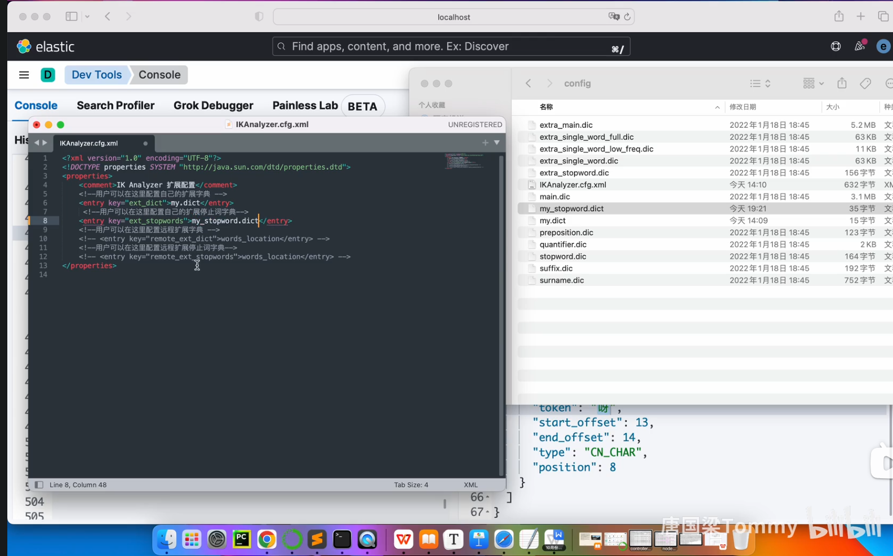

## llm
[](D:\software\one-api\download)

## 
elasticsearch-service.bat manager

[windows 安装 Elasticsearch 2025](https://blog.csdn.net/qq_41860765/article/details/146364126)

[es agent](https://elasticstack.blog.csdn.net/article/details/136253286)

[IK 中文分词器](https://blog.csdn.net/sinat_22797429/article/details/148909029)







[client 免费版， 但是不好用](https://www.yuque.com/baozhiyige-tewwf/ygxv4r/okgitrl4un1ed9du)

elasticsearch-create-enrollment-token -s kibana
[token 过期的解决方案](https://blog.csdn.net/wochunyang/article/details/143225533)


永久删除
rd /s /q 文件夹
还要卸载服务
sc delete elasticsearch


### elasticsearch
https://localhost:9200/

kibana 9.1.4 启动失败
https://discuss.elastic.co/t/kibana-9-1-4-on-windows-fails-to-start-due-to-timelion-plugin-cannot-find-module-series-functions-undefined/382144


### kibana 登录
http://localhost:5601/?code=161767

eyJ2ZXIiOiI4LjE0LjAiLCJhZHIiOlsiMTkyLjE2OC4zMS41ODo5MjAwIl0sImZnciI6IjQ4ZjYzYWE1MzkxNjU2NDUyN2I5OWUzNTg2ZWVlNGMyNWQyMmNmZGZmZDQ2YzViOWQ0ZTQxZmQ4YzZhYmI5ZjQiLCJrZXkiOiJJWUh0dFprQm5fVkVQbFBsQjFqdjpKR0cxd3lJYkVzbzhhN3Q2T2ZremZ3In0=


## 以下是四个文件中使用的 Elasticsearch 参数的解释，以及它们在 Elasticsearch 查询中的转换：

---

### **1. index_data_tool.py**
#### 参数解释：
- **`index`**: 索引名称，指定要查询的 Elasticsearch 索引。
- **`from_`**: 查询结果的起始位置，表示从第几条记录开始返回。
- **`size`**: 查询结果的大小，表示返回的记录数量。
- **`query`**: 查询条件，这里是 `{"match_all": {}}`，表示匹配所有文档。

#### 转换成 Elasticsearch 查询语句：
```json
GET /<index_name>/_search
{
  "from": <from_>,
  "size": <size>,
  "query": {
    "match_all": {}
  }
}
```

---

### **2. index_search_tool.py**
#### 参数解释：
- **`index`**: 索引名称，指定要查询的 Elasticsearch 索引。
- **`from_`**: 查询结果的起始位置，表示从第几条记录开始返回。
- **`size`**: 查询结果的大小，表示返回的记录数量。
- **`query`**: 查询条件，支持复杂的 JSON 格式查询。
- **`aggs`**: 聚合条件，用于执行聚合查询。
- **`sort`**: 排序条件，用于指定查询结果的排序方式。

#### 转换成 Elasticsearch 查询语句：
```json
GET /<index_name>/_search
{
  "from": <from_>,
  "size": <size>,
  "query": <query>,
  "aggs": <aggs>,
  "sort": <sort>
}
```

---

### **3. list_indices_tool.py**
#### 参数解释：
- **`h`**: 指定返回的字段，这里是 `index`，表示返回索引名称。
- **`s`**: 指定排序字段，这里是 `index`，表示按索引名称排序。

#### 转换成 Elasticsearch 查询语句：
```bash
GET /_cat/indices?h=index&s=index
```

---

### **4. index_details_tool.py**
#### 参数解释：
- **`get_alias`**: 获取索引的别名信息。
- **`get_field_mapping`**: 获取索引的字段映射信息。
- **`get_settings`**: 获取索引的设置信息。

#### 转换成 Elasticsearch 查询语句：
1. **获取索引别名**:
   ```json
   GET /<index_name>/_alias
   ```

2. **获取字段映射**:
   ```json
   GET /<index_name>/_mapping/field/*
   ```

3. **获取索引设置**:
   ```json
   GET /<index_name>/_settings
   ```

---

### 总结
这些工具通过 Elasticsearch 客户端调用了不同的 API，分别实现了数据查询、搜索、列出索引、以及获取索引详细信息的功能。

##

