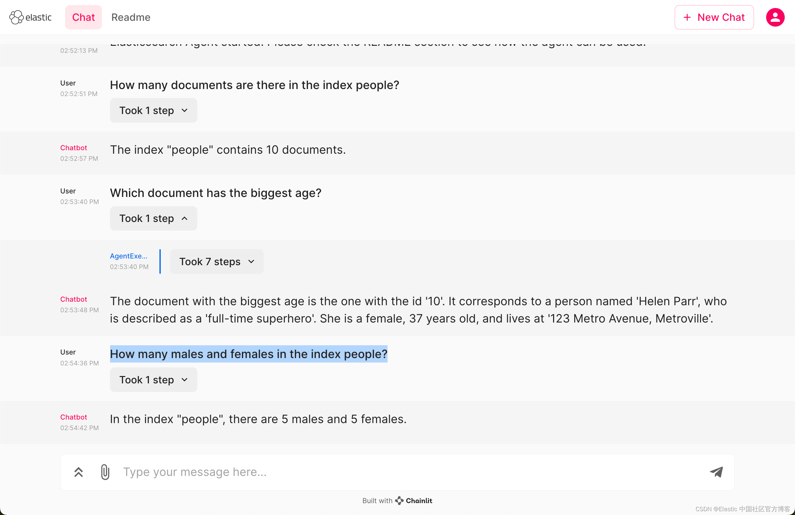

# Elasticsearch Langchain Agent (Enhanced version by Yuteng Zhao)
 
## third development with more tools (insert tool etc.)

This project uses ElasticSearch together with LangChain and ChatGPT 4 to build an agent with which you can ask intelligent questions on
top of an ElasticSearch cluster.

## output
The server output will be like ref: [output2.md](output2.md)

front end output will be like:



## Setup

start with command:

```
python  elasticsearch_agent/agent/test/agent_factory_test.py
```

## env

The configuration should be saved in a `.env` file.

```
OPENAI_API_KEY=<key>
OPENAI_MODEL=gpt-4-0613
# OPENAI_MODEL=gpt-3.5-turbo-16k-0613
REQUEST_TIMEOUT=300
LANGCHAIN_CACHE=false
CHATGPT_STREAMING=false
LLM_VERBOSE=true

# Elastic Search related
ELASTIC_SERVER=https://127.0.0.1:9200
ELASTIC_USER=elastic
ELASTIC_PASSWORD=<pass>
ELASTIC_VERIFY_CERTIFICATES=false

ELASTIC_INDEX_DATA_FROM=0
ELASTIC_INDEX_DATA_SIZE=5
ELASTIC_INDEX_DATA_MAX_SIZE=50

LANGCHAIN_VERBOSE=true
AGGS_LIMIT=200
TOKEN_LIMIT=6000
MAX_SEARCH_RETRIES = 100
```

